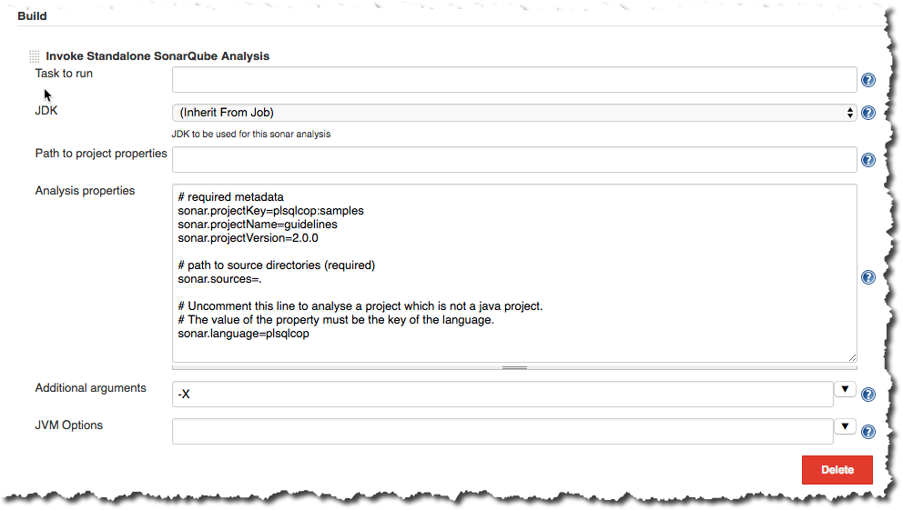
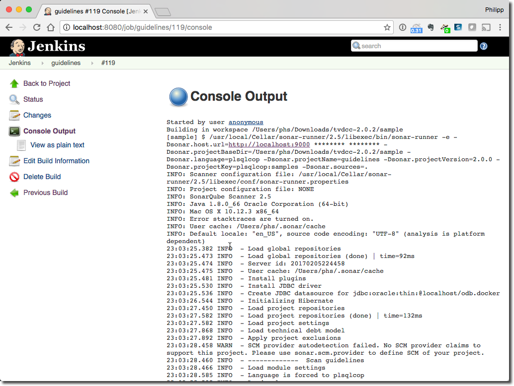
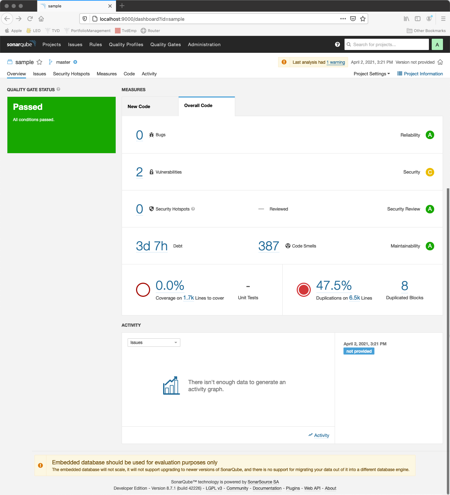
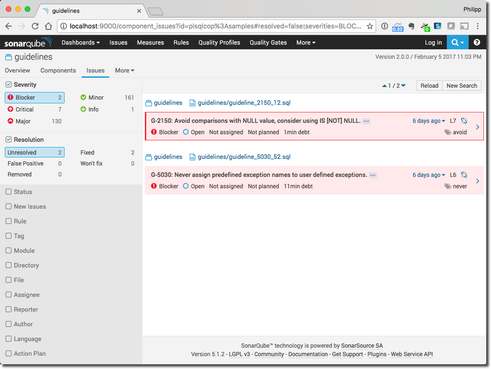
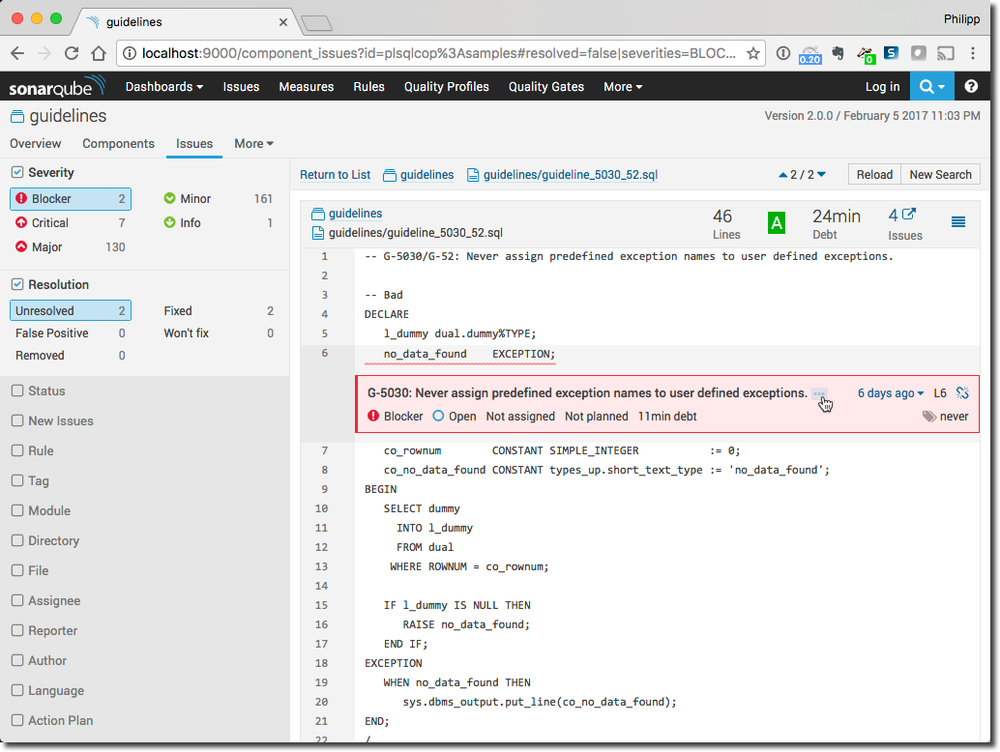
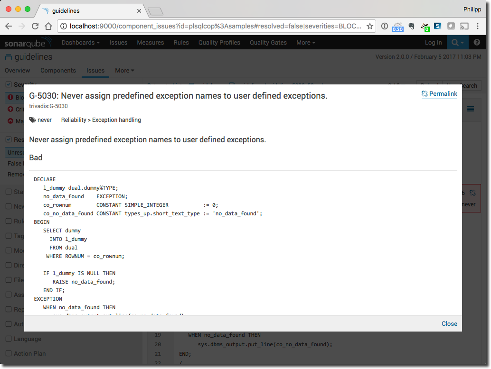
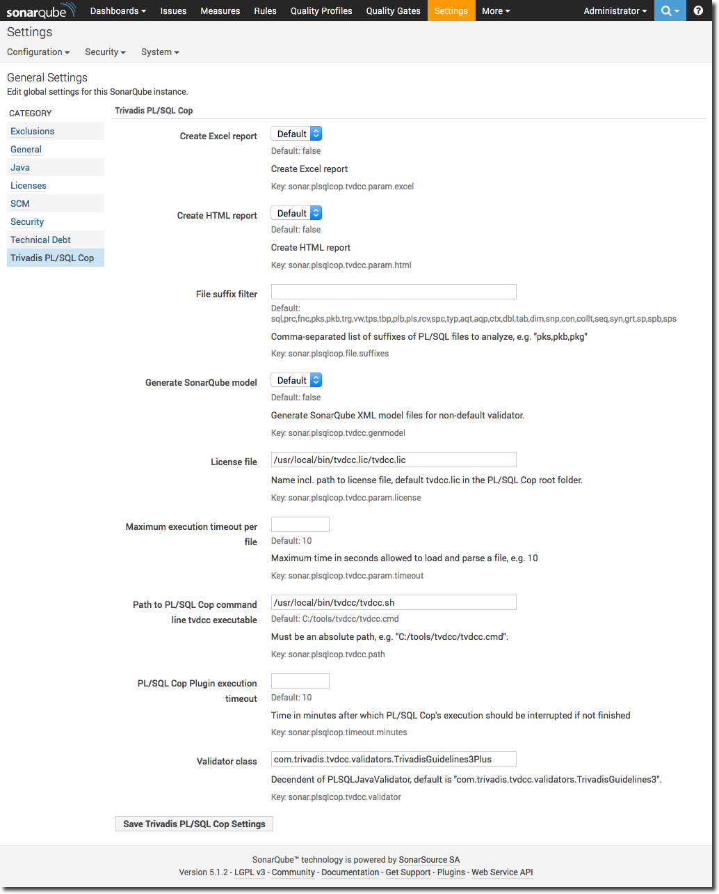

# PL/SQL Cop for SonarQube

## Introduction

PL/SQL Cop for SonarQube is a plugin for [SonarQube](http://www.sonarqube.org/). The plugin analyses SQL and PL/SQL code and calculates various metrics and checks the code for compliance of the [Trivadis PL/SQL & SQL Coding Guidelines Version 3.6](https://trivadis.github.io/plsql-and-sql-coding-guidelines/v3.6/). Behind the scenes the plugin calls the [PL/SQL Cop command line](https://github.com/Trivadis/plsql-cop-cli) utility for the static code analysis.

A static code analysis is typically initiated as part of an continuous integration setup, e.g. at the end of a Jenkins or Hudson build job. SonarQube stores the result of the analysis in a relational database. Supported are HSQLDB, PostgreSQL, MySQL, Microsoft SQL Server and Oracle Database, of course.

Since every analysis is stored as a snapshot in the SonarQube repository the improvement or the decrease of the code quality may be monitored very well. Use SonarQube and the PL/SQL Cop plugin if you care about your PL/SQL code quality.

## Examples

Setup a build job with a standalone SonarQube analysis at the end of the job. Here’s an example within a Jenkins build job:

Important are the analysis properties. The mandatory ones are sonar.projectKey, sonar.projectName, sonar.projectVersion and sonar.sources. You may defined them as shown above or within a sonar.properties file in the source folder. See the [SonarQube documentation](http://docs.sonarqube.org/display/SONAR/Analysis+Parameters) for more information.

The build job is typically started after a change in the software configuration system such as GIT, SVN or CVS or other relevant events. You may even trigger the build manually. The log of such a build job looks as follows:

At the bottom of a build log you find a link to the SonarQube project dashboard. Click on it and the following project dashboard is shown:

You see that 2 blocker issues have been found in the guideline project. Click on “2” to drill down to the blocker issues.

Click on the arrow on the right side of an issue to drill down to the source code.

Click on the three dots after the issue text to get more information about the violated guideline.

There are a lot more analysis available in [SonarQube](http://docs.sonarqube.org/display/SONAR/Installing+a+Plugin). Get your copy of [PL/SQL Cop](https://github.com/Trivadis/plsql-cop-cli/releases) and [PL/SQL Cop for SonarQube](https://github.com/Trivadis/plsql-cop-sonar/releases) now.

## Installation

Copy the downloaded sonar-plsql-cop-plugin-x.x.x.x.jar file into the extensions/plugins folder of your SonarQube installation and restart the [SonarQube](http://docs.sonarqube.org/display/SONAR/Installing+a+Plugin) server. Login as admin, click on “Settings” in the main menu bar and configure the “Trivadis PL/SQL Cop” section as shown below

Press “Save Trivadis PL/SQL Cop Settings” to the configuration.

The path to the PL/SQL Cop command line utility and the license file must be valid for the machine doing the analysis with [SonarQube Scanner](https://docs.sonarqube.org/display/SCAN/Analyzing+with+SonarQube+Scanner). If you are using Jenkins then PL/SQL Cop command line utility must be installed on every Jenkins node.

## Releases

It’s important to note, that each version of PL/SQL Cop for SonarQube requires specific versions of SonarQube. Updates are considered only for SonarQube LTS (long term support) versions.

| Plugin Version | Supported SonarQube Version | Required CLI Version |
| :------------: | :-------------------------: | :------------------: |
| [4.5.0.1](https://github.com/Trivadis/plsql-cop-sonar/releases/tag/v4.5.0.1) | 4.5 LTS - 5.1.2 | 2.3.0 |
| [5.6.0.2](https://github.com/Trivadis/plsql-cop-sonar/releases/tag/v5.6.0.2) | 5.6 LTS - 6.6 | 2.3.0 |
| [6.7.0.4](https://github.com/Trivadis/plsql-cop-sonar/releases/tag/v6.7.0.4) | 6.7 LTS - 7.6 | 2.3.0 |
| [7.9.0.1](https://github.com/Trivadis/plsql-cop-sonar/releases/tag/v7.9.0.1) | 7.9 LTS - 8.0 | 2.3.0 |

You find all releases and release information [here](https://github.com/Trivadis/plsql-cop-sonar/releases).

## Issues
Please file your bug reports, enhancement requests, questions and other support requests within [Github's issue tracker](https://help.github.com/articles/about-issues/).

* [Questions](https://github.com/trivadis/plsql-cop-sonar/issues?q=is%3Aissue+label%3Aquestion)
* [Open enhancements](https://github.com/trivadis/plsql-cop-sonar/issues?q=is%3Aopen+is%3Aissue+label%3Aenhancement)
* [Open bugs](https://github.com/trivadis/plsql-cop-sonar/issues?q=is%3Aopen+is%3Aissue+label%3Abug)
* [Submit new issue](https://github.com/trivadis/plsql-cop-sonar/issues/new)

## Frequently Asked Questions

see [Frequently Asked Questions](FAQ.md).

## Further Information

Please find further information about PL/SQL Cop on the [Trivadis](https://www.trivadis.com/en/plsql-cop) website.

## License

The preview/trial version of PL/SQL Cop for SonarQube is licensed under the Creative Commons Attribution-NonCommercial-NoDerivs 3.0 Unported License. You may obtain a copy of the License at https://creativecommons.org/licenses/by-nc-nd/3.0/.

The trial/preview version provides full functionality but is limited in time and volume.

For production use a separate software license agreement is required.
