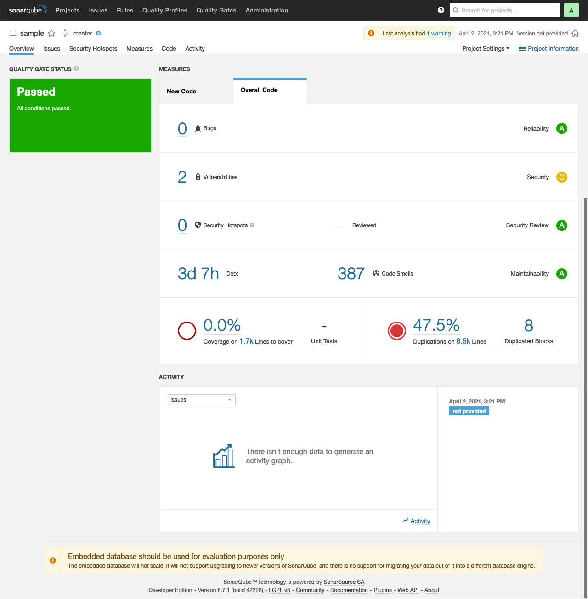
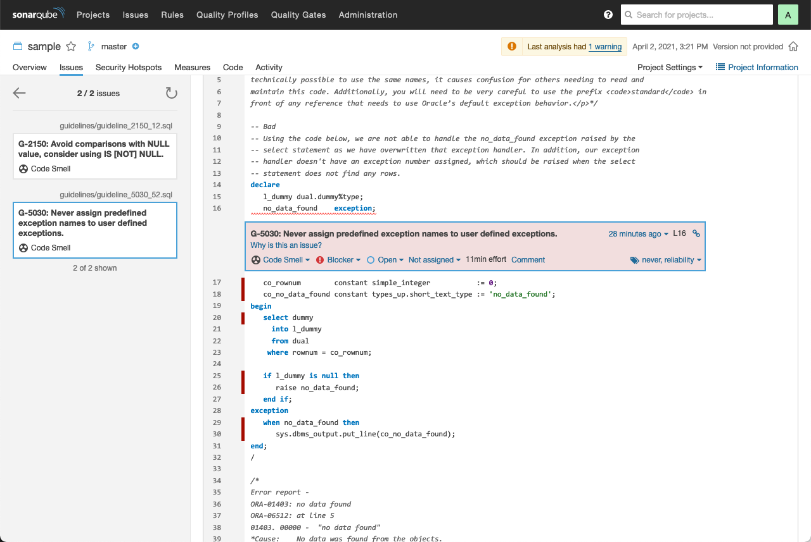
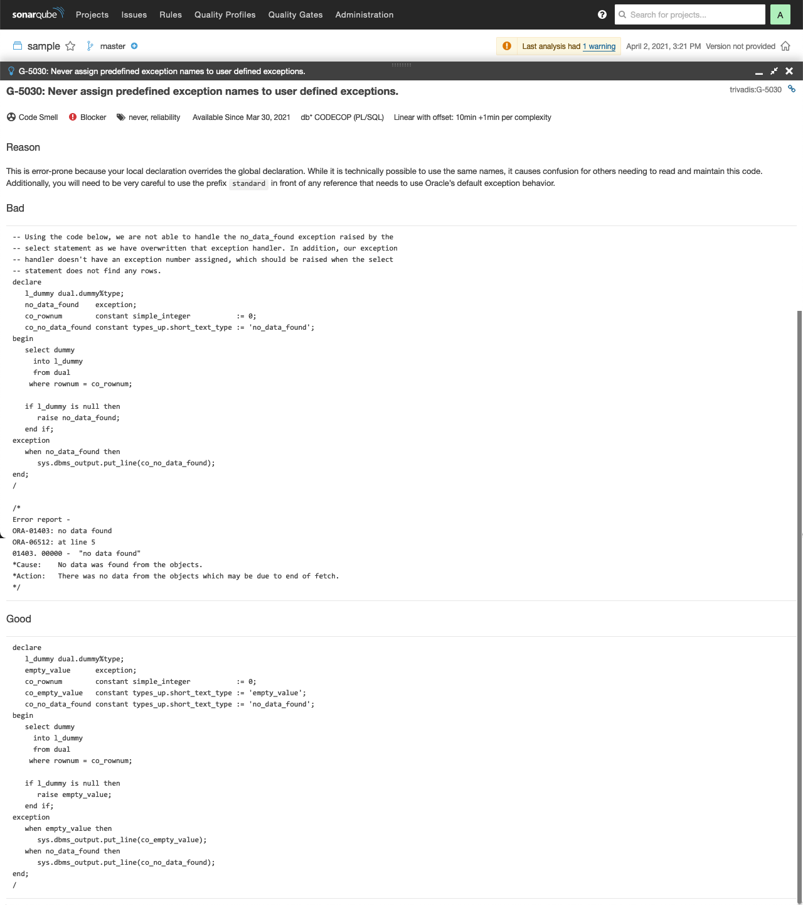

# db\* CODECOP for SonarQube

## Introduction

db\* CODECOP for SonarQube is a plugin for [SonarQube](http://www.sonarqube.org/). The plugin analyses SQL and PL/SQL code and calculates various metrics and checks the code for compliance of the [Trivadis PL/SQL & SQL Coding Guidelines Version 4.2](https://trivadis.github.io/plsql-and-sql-coding-guidelines/v4.2/).

A static code analysis is typically initiated as part of an continuous integration setup, e.g. at the end of a Jenkins or Hudson build job. SonarQube stores the result of the analysis in a relational database. Supported are PostgreSQL, Microsoft SQL Server and Oracle Database. For evaluation purposes, the embedded H2 database can also be used.

Since every analysis is stored as a snapshot in the SonarQube repository the improvement or the decrease of the code quality may be monitored very well. Use SonarQube and the db\* CODECOP plugin if you care about your PL/SQL code quality.

## Examples

### Run Code Analysis via SonarScanner

You start an analysis from the command line as follows (see [docs](https://docs.sonarqube.org/latest/analysis/scan/sonarscanner/) for more information):

```
sonar-scanner -Dsonar.projectKey="sample"
```

Here's an excerpt of the output:

```
INFO: Scanner configuration file: /usr/local/opt/sonar-scanner/conf/sonar-scanner.properties
INFO: Project root configuration file: NONE
INFO: SonarQube Scanner 4.1.0.1829
...
INFO: Project configuration:
INFO: 115 files indexed
INFO: Quality profile for plsql: db* CODECOP
INFO: ------------- Run sensors on module sample
INFO: JavaScript/TypeScript frontend is enabled
INFO: Define db* CODECOP PlugIn (Secondary)
INFO: Load metrics repository
INFO: Load metrics repository (done) | time=36ms
INFO: PlSQL COP Sensor initializing
INFO: Instantiate class: com.trivadis.sonar.plugin.TrivadisGuidelines3ValidatorConfig
INFO: Sensor CSS Rules [cssfamily]
INFO: No CSS, PHP, HTML or VueJS files are found in the project. CSS analysis is skipped.
INFO: Sensor CSS Rules [cssfamily] (done) | time=1ms
INFO: Sensor PL/SQL Sensor [plsql]
INFO: 115 source files to be analyzed
INFO: Load project repositories
INFO: Load project repositories (done) | time=10ms
...
INFO: Analysis report generated in 149ms, dir size=603 KB
INFO: Analysis report compressed in 1101ms, zip size=264 KB
INFO: Analysis report uploaded in 1858ms
INFO: ANALYSIS SUCCESSFUL, you can browse http://localhost:9000/dashboard?id=sample
INFO: Note that you will be able to access the updated dashboard once the server has processed the submitted analysis report
INFO: More about the report processing at http://localhost:9000/api/ce/task?id=AXiSv3IJVMRTx5sCSVMo
INFO: Analysis total time: 27.088 s
INFO: ------------------------------------------------------------------------
INFO: EXECUTION SUCCESS
INFO: ------------------------------------------------------------------------
INFO: Total time: 28.961s
INFO: Final Memory: 40M/144M
INFO: ------------------------------------------------------------------------
```

At the end of the run an URL to the scanner result is provided.

### Run Code Analyis with CI Environments

You can call the SonarScanner also from Gradle, .NET projects, Maven, Ant, Jenkins, etc. Whichever method you use, in the end the analysis report will be uploaded to SonarQube.

See [SonarScanner](https://docs.sonarqube.org/latest/analysis/scan/sonarscanner/) for more information.

### View Code Analysis Result in SonarQube

Here are the results of the previous analysis.



Under `Issues` the following `Blocker` are shown:


By clicking on the reddish box you can drill down to the source code.



When clicking on `Why is this an issue?` the complete rule is shown in simlar way as in the [Trivadis PL/SQL & SQL Coding Guidelines v4.2](https://trivadis.github.io/plsql-and-sql-coding-guidelines/v4.2/4-language-usage/5-exception-handling/g-5030/).



See [SonarQube documentation](https://docs.sonarqube.org/latest/) for more information.

## Installation

db\* CODECOP provides two types of plugins. 

- [Standalone Plugin](#standalone-plugin)
  
  Use this plugin if db\* CODECOP is the only SonarQube plugin that processes SQL and PL/SQL related files.

- [Secondary Plugin](#secondary-plugin)
  
  Use this plugin if you plan to use another PL/SQL SonarQube plugin together with db\* CODECOP. 
  
  By default, SonarQube allows only one plugin to process a given file extension. Therefore, it is not possible to use the standalone plugin in this scenario.
  
  The secondary plugin allows you to configure another plugin as the primary plugin. The primary plugin is the one that is responsible to manage the associated file extensions.
  
  The secondary plugin was tested with the following plugins:

    - [SonarPLSQL](https://docs.sonarqube.org/latest/analysis/languages/plsql/) (default)
    - [ZPA](https://felipezorzo.com.br/zpa/)
  
  However, it should be possible to configure other primary plugins.

### Standalone Plugin

Download the `sonar-plsql-cop-standalone-x.x.x.jar` from [releases](https://github.com/Trivadis/plsql-cop-sonar/releases). Then copy it to the `extensions/plugins` folder of your SonarQube installation and restart the [SonarQube](http://docs.sonarqube.org/display/SONAR/Installing+a+Plugin) server. Login as admin, click on `Administration` in the main menu bar and configure the `db* CODECOP` section as shown below.


The `File suffix filter` associates file extensions to the db\* CODECOP plugin.

Paste the content of the `.lic` file you've got from your Trivadis representative into the `license file` field.

The `Validator Config class` defines defines the validator with its rules and quality profile for SonarQube. By default, the following classes are available:

Validator Config class | Description
--- | ---
com.trivadis.sonar.plugin.TrivadisGuidelines3ValidatorConfig | Rules based on [Trivadis PL/SQL & SQL Coding Guidelines 4.2](https://trivadis.github.io/plsql-and-sql-coding-guidelines/v4.2/). This is the default.
com.trivadis.sonar.plugin.TrivadisGuidelines2ValidatorConfig | Rules based [Trivadis PL/SQL & SQL Coding Guidelines 4.2](https://trivadis.github.io/plsql-and-sql-coding-guidelines/v4.2/), but only those that were available in [v2.0](https://trivadis.github.io/plsql-and-sql-coding-guidelines/v4.2/9-appendix/appendix/#b-mapping-new-guidelines-to-prior-versions) using two digits per rule.
com.trivadis.sonar.plugin.EmptyPLSQLValidatorConfig | Minimal rule set (G-0000, E-000x), e.g. to calculate metrics only.

You can create and configure custom validator config classes. See [this GitHub project](https://github.com/Trivadis/plsql-cop-validators) for more information. 

### Secondary Plugin

Download the `sonar-plsql-cop-secondary-x.x.x.jar` from [releases](https://github.com/Trivadis/plsql-cop-sonar/releases). Then copy it to the `extensions/plugins` folder of your SonarQube installation and restart the [SonarQube](http://docs.sonarqube.org/display/SONAR/Installing+a+Plugin) server. Login as admin, click on `Administration` in the main menu bar and configure the `db* CODECOP` section as shown below.


The `Language Key` identifies the primary plugin which manages the file associations and is responsible for some common code analysis tasks. Enter `plsql` for [SonarPLSQL](https://docs.sonarqube.org/latest/analysis/languages/plsql/) or `plsqlopen` for [ZPA](https://felipezorzo.com.br/zpa/).

The meaning of `License file` and `Validator Config class` is identical to the standalone plugin. 

## Compatibiltiy

The current plugins are compatible with all on-premises SonarQube editions (Community, Developer, Enterprise and Data Center).

- Minumum SonarQube version: 7.9
- Latest SonarQube version tested: 9.8.0

## Frequently Asked Questions

see [Frequently Asked Questions](FAQ.md).

## Further Information

Please find further information about db\* CODECOP on the [Trivadis](https://www.trivadis.com/en/dbstar) website.

## License

The preview/trial version of db\* CODECOP for SonarQube is licensed under the Creative Commons Attribution-NonCommercial-NoDerivs 3.0 Unported License. You may obtain a copy of the License at https://creativecommons.org/licenses/by-nc-nd/3.0/.


The trial/preview version provides full functionality but is limited in time and volume.

For production use a separate software license agreement is required.
